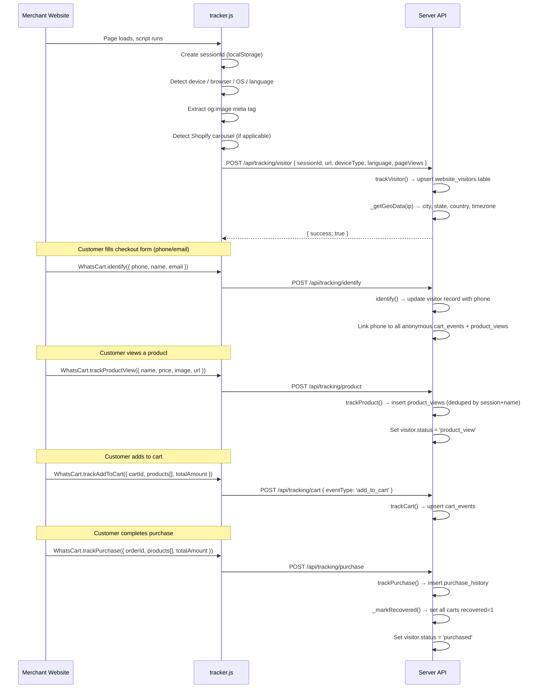
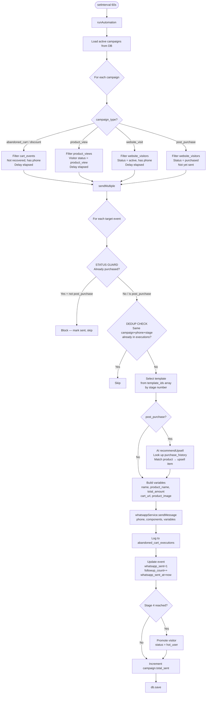
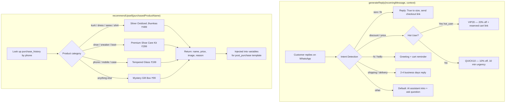
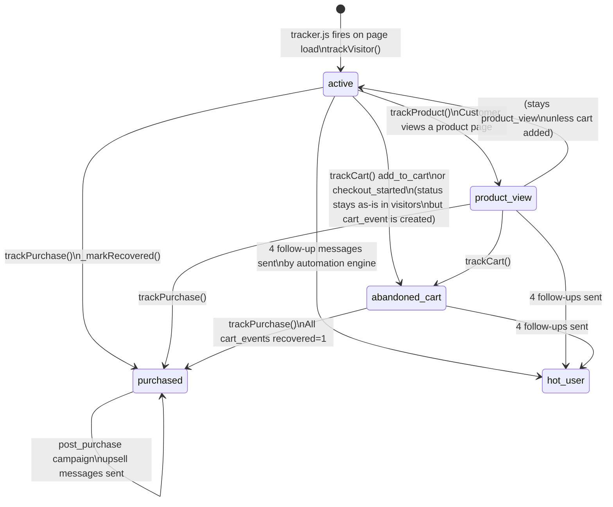

# WhatsWay Pro — Full Architecture & Flow Diagrams

---

## 1. SYSTEM OVERVIEW

```
┌─────────────────────────────────────────────────────────────────────┐
│                        MERCHANT'S WEBSITE                           │
│   <script src="tracker.js">  →  window.WhatsCart API               │
└───────────────────────────┬─────────────────────────────────────────┘
                            │  HTTP POST /api/tracking/*
                            ▼
┌─────────────────────────────────────────────────────────────────────┐
│               EXPRESS SERVER  (port 3005)                           │
│                                                                     │
│   Routes → Controllers → Services → JSON Database (data/*.json)    │
│                                                                     │
│   Automation Engine (every 60s) ──► WhatsApp Service (mock send)   │
│                                ──► AI Service (upsell / reply)      │
└─────────────────────────────────────────────────────────────────────┘
                            │  REST API /api/*
                            ▼
┌─────────────────────────────────────────────────────────────────────┐
│               REACT DASHBOARD  (port 3000)                          │
│                                                                     │
│   Dashboard · Visitors · Campaigns · Templates                      │
│   CartEvents · Contacts · Analytics · Settings                      │
└─────────────────────────────────────────────────────────────────────┘
```

---

## 2. TRACKER.JS — VISITOR TRACKING FLOW



---

## 3. AUTOMATION ENGINE — EVERY 60 SECONDS



---

## 4. WHATSAPP SERVICE — MESSAGE SEND PIPELINE

```mermaid
flowchart LR
    A[sendMessage\nphone, components, variables] --> B[Format phone\nAdd 91 prefix if missing]
    B --> C[Find body component\nReplace all mustache vars\n{{name}} → Priya]
    C --> D{Header IMAGE\ncomponent?}
    D -->|Yes| E[Attach product_image URL\nto media payload]
    D -->|No| F
    E --> F{Button CTA\ncomponent?}
    F -->|Yes| G[Inject dynamic URL\nfrom variables.cart_url]
    F -->|No| H
    G --> H{Carousel\ncomponent?}
    H -->|Yes| I[Parse shopify_carousel JSON\nBuild product cards\nname + price + link per item]
    H -->|No| J
    I --> J[Generate messageId\nmsg_timestamp_random]
    J --> K[Console log payload\nMock send in dev]
    K --> L[Return messageId]
```

---

## 5. AI SERVICE — FUNCTIONS



---

## 6. DATABASE SCHEMA (JSON File)

```
data/whatsway.json
│
├── website_visitors[]
│   id, channel_id, session_id, phone, email, name
│   ip_address, country, country_code, state, city
│   language, device_type, browser, page_url
│   status: active | product_view | purchased | hot_user
│   visited_at, created_at
│
├── cart_events[]
│   id, channel_id, session_id, phone, email, name
│   event_type: add_to_cart | checkout_started | checkout_completed
│   cart_id, products (JSON), total_amount, currency
│   product_name, product_image, product_url, cart_url
│   whatsapp_sent (0/1), recovered (0/1), followup_count
│   whatsapp_sent_at, recovered_at, created_at
│
├── purchase_history[]
│   id, channel_id, phone, order_id
│   products (JSON), total_amount, purchased_at
│
├── product_views[]
│   id, channel_id, session_id, phone
│   product_name, product_image, product_url, product_price
│   whatsapp_sent, followup_count, created_at
│
├── page_views[]
│   id, channel_id, session_id, url, page_title, viewed_at
│
├── searches[]
│   id, channel_id, session_id, query, results_count, searched_at
│
├── custom_events[]
│   id, channel_id, session_id, event_name, properties (JSON)
│
├── message_templates[]
│   id, channel_id, name, category, language
│   components (JSON array of {type, text, format, buttons})
│   variables (JSON), preview, is_active, created_at
│
├── abandoned_cart_campaigns[]
│   id, channel_id, name, campaign_type, target_segment
│   template_id, template_ids[] (4-stage array)
│   delay_hours, is_active, total_sent, total_recovered
│   last_run_at, created_at
│
├── abandoned_cart_executions[]
│   id, campaign_id, phone, name, template_id
│   stage (1-4), status: sent, sent_at, product_image
│
├── user_sessions[]
├── channel_settings[]
│   channel_id, settings (JSON: WhatsApp credentials, config)
│
└── _counters{}  ← auto-increment IDs per table
```

---

## 7. ALL API ENDPOINTS

```
SERVER: http://localhost:3005

TRACKING (from tracker.js on merchant website)
  POST /api/tracking/visitor      → trackVisitor()    log/update visitor
  POST /api/tracking/identify     → trackIdentify()   link phone to session
  POST /api/tracking/pageview     → trackPageView()   log page visit
  POST /api/tracking/product      → trackProduct()    log product view
  POST /api/tracking/cart         → trackCart()       log add_to_cart
  POST /api/tracking/checkout     → trackCheckout()   checkout started/completed
  POST /api/tracking/purchase     → trackPurchase()   order completed → recover
  POST /api/tracking/search       → trackSearch()     log search query
  POST /api/tracking/custom       → trackCustom()     log any custom event

VISITORS (Dashboard)
  GET  /api/visitors              → getVisitors()     paginated list + filters
  GET  /api/visitors/stats        → getStats()        total/active/withPhone counts
  GET  /api/visitors/:id          → getVisitor()      single visitor
  GET  /api/visitors/:id/carts    → getVisitorCarts() cart history
  GET  /api/visitors/:id/activity → getVisitorActivity() full timeline

CAMPAIGNS
  GET    /api/campaigns           → getCampaigns()    list all
  POST   /api/campaigns           → createCampaign()  new campaign
  GET    /api/campaigns/:id       → getCampaign()     single
  PUT    /api/campaigns/:id       → updateCampaign()  edit
  DELETE /api/campaigns/:id       → deleteCampaign()  remove
  POST   /api/campaigns/:id/send  → sendCampaign()    manual blast
  POST   /api/campaigns/:id/status→ updateStatus()    toggle active
  GET    /api/campaigns/:id/executions → getExecutions() send history

TEMPLATES
  GET    /api/templates           → getTemplates()    list with filter
  POST   /api/templates           → createTemplate()  new template
  GET    /api/templates/:id       → getTemplate()     single
  PUT    /api/templates/:id       → updateTemplate()  edit
  DELETE /api/templates/:id       → deleteTemplate()  remove

ANALYTICS
  GET /api/analytics?period=7     → getAnalytics()    byDay, topCities, campaignPerf
  GET /api/analytics/dashboard    → getDashboard()    full KPI object

CART EVENTS
  GET /api/cart-events            → list with status filter

CONTACTS
  GET /api/contacts               → visitors with phone numbers

SETTINGS
  GET  /api/settings              → channel settings
  POST /api/settings              → save settings
  POST /api/settings/test-whatsapp→ send test message

WHATSAPP
  POST /api/whatsapp/webhook      → incoming reply → AI generateReply()
```

---

## 8. VISITOR STATUS LIFECYCLE



---

## 9. CAMPAIGN TYPES & THEIR TARGETS

```
┌─────────────────────┬──────────────────────┬─────────────────────────────┐
│ Campaign Type       │ Target Source        │ Condition                   │
├─────────────────────┼──────────────────────┼─────────────────────────────┤
│ abandoned_cart      │ cart_events          │ not recovered, has phone    │
│ discount            │ cart_events          │ same as abandoned_cart      │
│ product_view        │ product_views        │ visitor.status=product_view │
│ website_visit       │ website_visitors     │ status=active, has phone    │
│ post_purchase       │ website_visitors     │ status=purchased            │
└─────────────────────┴──────────────────────┴─────────────────────────────┘

4-STAGE FOLLOW-UP SEQUENCE (per campaign)
  Stage 1 → template_ids[0]   Initial send
  Stage 2 → template_ids[1]   24h later follow-up
  Stage 3 → template_ids[2]   48h later follow-up
  Stage 4 → template_ids[3]   72h later → promotes to HOT USER
```

---

## 10. REACT DASHBOARD PAGES & DATA SOURCES

```
┌──────────────┬────────────────────────────────────────────────────┐
│ Page         │ API Calls                                          │
├──────────────┼────────────────────────────────────────────────────┤
│ Dashboard    │ GET /api/visitors/stats                            │
│              │ GET /api/analytics?period=7  (byDay chart)        │
│              │ GET /api/campaigns           (active list)         │
├──────────────┼────────────────────────────────────────────────────┤
│ Visitors     │ GET /api/visitors?page&search&device&status        │
│              │ GET /api/visitors/stats                            │
├──────────────┼────────────────────────────────────────────────────┤
│ Campaigns    │ GET/POST/PUT/DELETE /api/campaigns                 │
│              │ POST /api/campaigns/:id/send                       │
│              │ GET  /api/campaigns/:id/executions                 │
├──────────────┼────────────────────────────────────────────────────┤
│ Templates    │ GET/POST/PUT/DELETE /api/templates                 │
├──────────────┼────────────────────────────────────────────────────┤
│ Cart Events  │ GET /api/cart-events?status=                       │
├──────────────┼────────────────────────────────────────────────────┤
│ Contacts     │ GET /api/contacts?search&language                  │
├──────────────┼────────────────────────────────────────────────────┤
│ Analytics    │ GET /api/analytics?period=7/14/30                  │
├──────────────┼────────────────────────────────────────────────────┤
│ Settings     │ GET/POST /api/settings                             │
│              │ POST /api/settings/test-whatsapp                   │
└──────────────┴────────────────────────────────────────────────────┘
```

---

## 11. FULL END-TO-END FLOW EXAMPLE

```
1. Customer visits https://mystore.com
   └─► tracker.js fires → POST /api/tracking/visitor
       └─► DB: website_visitors[status=active]

2. Customer views "Blue Kurti" product page
   └─► WhatsCart.trackProductView({name:"Blue Kurti", price:799})
       └─► POST /api/tracking/product
           └─► DB: product_views[phone=null, session=abc]
           └─► DB: visitor.status = 'product_view'

3. Customer fills checkout form with phone 9876543210
   └─► WhatsCart.identify({phone:"9876543210", name:"Priya"})
       └─► POST /api/tracking/identify
           └─► DB: visitor.phone = 9876543210
           └─► DB: product_views[session=abc].phone = 9876543210

4. Customer adds to cart ₹799
   └─► WhatsCart.trackAddToCart({cartId, products, totalAmount:799})
       └─► POST /api/tracking/cart
           └─► DB: cart_events[phone=9876543210, recovered=0]

5. Customer leaves without buying

6. Automation Engine runs (60s later)
   └─► Finds abandoned_cart campaign "1 Hour Reminder" (delay_hours=1)
   └─► Finds cart_event for 9876543210 (created > 1h ago)
   └─► STATUS GUARD: visitor.status ≠ 'purchased' → proceed
   └─► DEDUP CHECK: no execution for this campaign+phone+stage1
   └─► Select template_ids[0] = template #101
   └─► Build variables: name=Priya, total_amount=799
   └─► whatsappService.sendMessage("9876543210", components, vars)
       └─► Format phone → 919876543210
       └─► Replace {{name}} → Priya, {{total_amount}} → 799
       └─► [Mock] Log payload to console
   └─► DB: abandoned_cart_executions[stage=1, status=sent]
   └─► DB: cart_event.followup_count = 1

7. Customer replies "Do you have discount?"
   └─► POST /api/whatsapp/webhook {from:"919876543210", text:"discount?"}
       └─► aiService.generateReply("discount?", {product_name:"Blue Kurti"})
           └─► Intent: includes "discount"
           └─► visitor.status ≠ hot_user → reply with QUICK10 10% off
       └─► whatsappService.sendMessage(reply text)

8. Customer completes purchase
   └─► WhatsCart.trackPurchase({orderId, products, totalAmount:799})
       └─► POST /api/tracking/purchase
           └─► DB: purchase_history inserted
           └─► _markRecovered(): all cart_events.recovered = 1
           └─► DB: visitor.status = 'purchased'

9. Post-purchase campaign fires (automation engine)
   └─► Finds visitor.status = 'purchased'
   └─► aiService.recommendUpsell("Blue Kurti")
       └─► Matches 'kurti' → returns Silver Jhumkas ₹499
   └─► Variables: product_name=Silver Jhumkas, product_price=499
   └─► Sends upsell WhatsApp message
```

---

## 12. PROJECT FILE STRUCTURE

```
TRK/
├── tracker.js                    ← Embed on merchant websites
├── package.json                  ← Root: runs both server+client via concurrently
│
├── server/
│   ├── src/
│   │   ├── index.js              ← Express app, port 3005, registers all routes
│   │   ├── routes/
│   │   │   ├── tracking.routes.js
│   │   │   ├── visitors.routes.js
│   │   │   ├── campaigns.routes.js
│   │   │   ├── templates.routes.js
│   │   │   ├── analytics.routes.js
│   │   │   ├── cartEvents.routes.js
│   │   │   ├── contacts.routes.js
│   │   │   ├── settings.routes.js
│   │   │   └── whatsapp.routes.js
│   │   ├── controllers/
│   │   │   ├── tracking.controller.js   ← All tracker.js event handlers
│   │   │   ├── visitors.controller.js   ← Visitor list, stats, activity
│   │   │   ├── campaigns.controller.js  ← Campaign CRUD + manual send
│   │   │   ├── templates.controller.js  ← Template CRUD
│   │   │   └── analytics.controller.js  ← KPIs, daily stats, city breakdown
│   │   ├── services/
│   │   │   ├── database.js       ← JSON file DB engine + seed data
│   │   │   ├── whatsapp.service.js ← Message formatting + send (mock)
│   │   │   ├── ai.service.js     ← Intent detection + upsell recommendations
│   │   │   └── geo.service.js    ← IP geolocation (placeholder)
│   │   ├── jobs/
│   │   │   └── automation.js     ← 60s interval engine, all campaign types
│   │   └── middleware/
│   │       └── errorHandler.js
│   ├── .env                      ← PORT=3005, CHANNEL_ID=demo
│   └── tsconfig.json
│
├── client/
│   ├── src/
│   │   ├── App.jsx               ← Router + layout
│   │   ├── api.js                ← All HTTP calls to server
│   │   ├── mockData.js           ← Mock responses (VITE_MOCK_API=false now)
│   │   ├── pages/
│   │   │   ├── Dashboard.jsx
│   │   │   ├── Visitors.jsx
│   │   │   ├── Campaigns.jsx
│   │   │   ├── Templates.jsx
│   │   │   ├── CartEvents.jsx
│   │   │   ├── Contacts.jsx
│   │   │   ├── Analytics.jsx
│   │   │   └── Settings.jsx
│   │   └── components/
│   │       ├── Sidebar.jsx
│   │       └── Header.jsx
│   └── .env                      ← VITE_API_URL=http://localhost:3005
│
└── data/
    └── whatsway.json             ← Live database (auto-created on first run)
```
